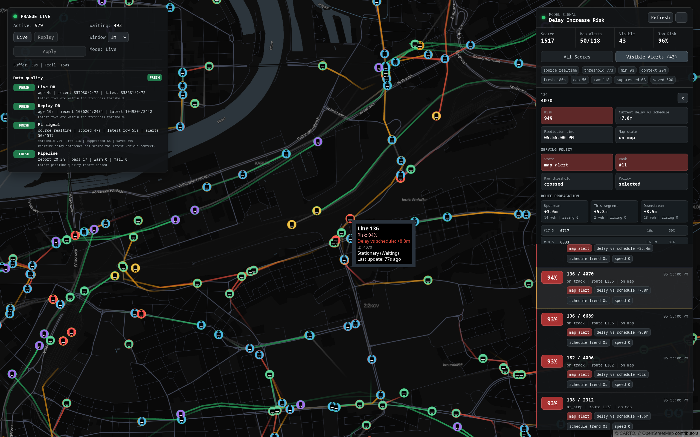

# UrbanPulse

UrbanPulse is a small, work-in-progress project for collecting and exploring
Prague public transport data. It began as a realtime vehicle map and has been
gradually shaped into a more complete data project with ingestion, storage,
replay, orchestration, CI, and early delay-prediction experiments.

The system collects vehicle positions from Golemio, keeps recent operational
state in PostgreSQL/TimescaleDB, streams live updates through Redis and
WebSocket, and renders vehicles on a React map. Historical data can be replayed
from the database, while larger offline experiments are being moved into a
DuckDB and Parquet based ML workspace.

The project is still intentionally humble. The main value so far has been in
learning how realtime transport data behaves, where the data quality problems
appear, and what kind of pipeline is needed before more advanced graph-based
models are worth using.



## What Has Been Built

- A FastAPI data service has been added for Golemio polling, replay endpoints,
  database migrations, and delay-risk artifact serving.
- Redis and a Node realtime gateway have been used for live browser updates.
- PostgreSQL/TimescaleDB has been used as the operational store for positions
  and trajectory points.
- A React, Deck.gl, and MapLibre frontend has been built for live and replayed
  vehicle movement.
- DuckDB, Parquet, Polars, and scikit-learn have been added for offline feature
  building and baseline delay models.
- W&B experiment tracking has been added for delay-model training and alert
  scoring runs.
- GitHub Actions, Docker image publishing, Kubernetes manifests, vulnerability
  scans, and an Airflow DAG have been added as the first production-style
  project scaffolding.

## Architecture and usage

The realtime serving path is kept lighter than the offline ML path.

```text
Golemio -> FastAPI data service -> Redis -> realtime gateway -> frontend
                         |
                         v
                 PostgreSQL/TimescaleDB
                         |
                         v
          minute-level delay-risk inference
```

The operational database is used by the live app and replay endpoints. DuckDB is
not part of the live serving path. It is used under `ml/` for local analytical
work, larger exports, feature datasets, and model training.

The offline path is now orchestrated by Airflow.

```text
optional CSV fetch -> DB migrations -> DuckDB lake -> features -> train -> score alerts
```

The scored output is written to `ml/models/delay_increase_alerts.json`. That
file is served by `GET /delay-increase-alerts` and is shown in the frontend risk
panel. When the file has not been produced yet, an empty alert list is returned
instead of an error.

For live use, the saved delay-increase model is loaded by the FastAPI service.
Recent `vehicle_positions` rows are turned into the same lagged feature shape
every minute, and the in-memory scored snapshot is served by the same
`GET /delay-increase-alerts` endpoint. The Airflow-scored JSON remains a
fallback when no live snapshot has been produced yet.

## Local Shape

A local backend session has usually been run with Docker for the shared
services and Python for the FastAPI process.

```bash
docker compose up -d redis timescaledb pgadmin

cd apps/data-service
python -m uvicorn main:app --host 127.0.0.1 --port 8000
python logger.py
```

The frontend and gateway have been run in separate terminals during local
development.

```bash
cd apps/realtime-gateway && npm run dev
cd apps/frontend && npm run dev
```

The backend services can also be brought up through Compose.

```bash
docker compose up -d redis timescaledb data-api data-worker
```

## Airflow

Airflow has been added as the single entry point for the offline data and ML
workflow. The local Airflow profile uses its own metadata Postgres container and
a custom image with the ML dependencies needed by the DAG.

```bash
grep -q '^AIRFLOW_UID=' .env || echo "AIRFLOW_UID=$(id -u)" >> .env
mkdir -p airflow/logs
docker compose --profile airflow up airflow-init
docker compose --profile airflow up -d airflow-webserver airflow-scheduler
```

The UI is exposed at `http://127.0.0.1:8080`. The DAG is named
`urbanpulse_ml_alerts`, and it is paused by default so the first run can be
started deliberately from the Airflow UI.

More detail is kept in `airflow/README.md`.

## Database Migrations

SQL migrations are stored in `apps/data-service/migrations`. The FastAPI service
and the worker both run the migration runner on startup. Applied versions are
recorded in `schema_migrations`, and a Postgres advisory lock is used so both
services can start at the same time.

TimescaleDB hypertable setup, compression, and retention are applied
idempotently after the schema migrations.

```bash
cd apps/data-service
python -m db_migrations
```

## CI And Deployment

GitHub Actions have been configured for pull requests and pushes to
`main`/`master`. The current pipeline installs dependencies, runs linting and
tests for the frontend, realtime gateway, and Python services, validates Docker
builds, and runs vulnerability scans.

The local checks mirror the CI shape.

```bash
cd apps/frontend && npm run lint && npm test && npm run build
cd apps/realtime-gateway && npm run lint && npm test && npm run build
python -m pip install -r requirements-dev.txt
python -m ruff check apps/data-service ml/scripts tests/python
python -m pytest
```

The vulnerability scan stage currently reports `npm audit`, `pip-audit`, and
Trivy findings without blocking every pull request. That decision was made so
existing findings could be triaged gradually before the scans are promoted into
release gates.

Docker images are published to GitHub Container Registry by the publish
workflow. Kubernetes manifests are kept in `deploy/kubernetes`, with the current
cluster notes in `deploy/kubernetes/README.md`.

## What Comes Next

- Clearer data retention, export, and backup rules are still needed.
- The frontend and backend are still being polished around empty states,
  observability, and failure handling.
- The Airflow workflow is expected to move from local files toward an
  object-storage layout.
- W&B is being used as the comparison layer for delay-model runs as feature
  sets and training windows keep changing.
- AWS deployment is planned later, likely with Terraform once the local and VPS
  shape has settled.
- GNN work is planned after the tabular baseline and data quality checks have
  earned enough trust to act as a fair benchmark.
